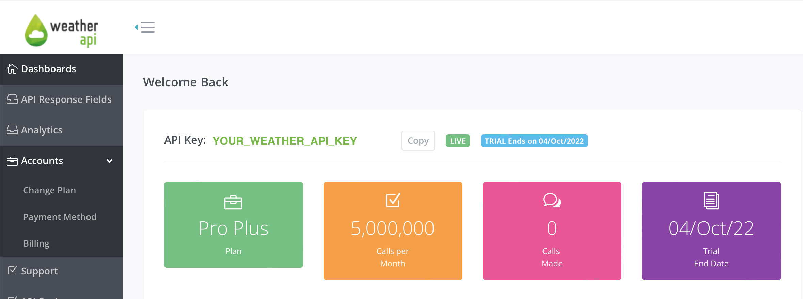

<p align="center"><a href="https://laravel.com" target="_blank"></a></p>

# Weather API
## Introduction
This is a demonstrative example of a resourceful API layer, leveraging third-party APIs to 
deliver current and forecasted weather data that can only be accessed via JWT authentication.

As highlighting DRY and SOLID principles are desirable, there is a high-level insight on how I 
would usually integrate multiple APIs to achieve the same goal using a _Single Source of Truth_. This principle is imperative in ensuring 
that the API service layer is both scalable and maintainable. Being able to make simple adjustments via a config-driven 
environment (using 𝑘=𝑣) enables us to create abstract interfaces that can be used to integrate new, additional APIs easily.

## Requirements
- PHP 8.1+ (Necessary for enumeration and intersection/union type checking)
- Composer 2.0+
- API Key for Weather API:
	- [WeatherAPI](https://www.weatherapi.com/)

## Optional Requirements
- MySQL - can use SQLite if you don't have MySQL installed.
- [Postman](https://postman.com) for testing API calls.

## Installation
### 1. Retrieve a WeatherAPI Key
First, create an account on [WeatherAPI](https://www.weatherapi.com/) and get your [API key](https://www.weatherapi.com/my/) 
from the dashboard on your account. Note the following key:



---

### 2. Setup
1. Clone the repository:
```bash
git clone https://github.com/DevJMD/laravel-weather-api.git && cd laravel-weather-api
``` 
2. Install Composer dependencies:
```bash
composer install
```  
4. From the WeatherAPI dashboard, copy the API key you created in **_Step 1_** into the `.env` file as the value 
for `WEATHER_API_KEY`:
```dotenv
WEATHER_API_KEY=<YOUR_WEATHER_API_KEY>
``` 
5. If you're not using MySQL, you can use SQLite by changing the `DB_CONNECTION` value to `sqlite`
in your `.env` file:
```dotenv
DB_CONNECTION=sqlite
```

 - _5a._ _**Optional:**_ If you're using MySQL, you'll need to create a database called `weather`, and update the database credentials in your `.env` file:
```dotenv
DB_CONNECTION=mysql
DB_HOST=127.0.0.1
DB_PORT=3306
DB_DATABASE=weather
DB_USERNAME=<your-mysql-server-username>
DB_PASSWORD=<your-mysql-server-password>
```

6. Add the following to your `.env` file:
```dotenv
API_VERSION=1
API_URL_PREFIX=api
API_ROUTE_PREFIX=api.v1
API_MIDDLEWARE=api
```

7. Generate a new JWT secret:
```bash
php artisan jwt:secret
```

8. Migrate and seed the database:
```bash
php artisan migrate --seed
```

### 3. Run the application
Run the following command to spin up a PHP development server:
```bash
php artisan serve
```

Now, visit [http://localhost:8000/api/v1](http://localhost:8000/api/v1) to check the application is running.

### 4. Unit Testing
Run PHPUnit tests:
```bash
php artisan test
```

### 5. Postman Endpoints
For obvious security purposes, registration is not a feature. You can authenticate with:
- Email: `demo@demo.com`
- Password: `password`

**Don't forget to set the Environment in the top-right of Postman.** Set it to "Production" to test live,
and "Local" to test a local build.

This information should already be filled in. View it here:

Public endpoint is for testing-only. No data is stored in a real database.

https://www.postman.com/infrasym/workspace/reasondigital/collection/960020-41f7109f-d425-47ab-89bd-d6234c688051?ctx=documentation


